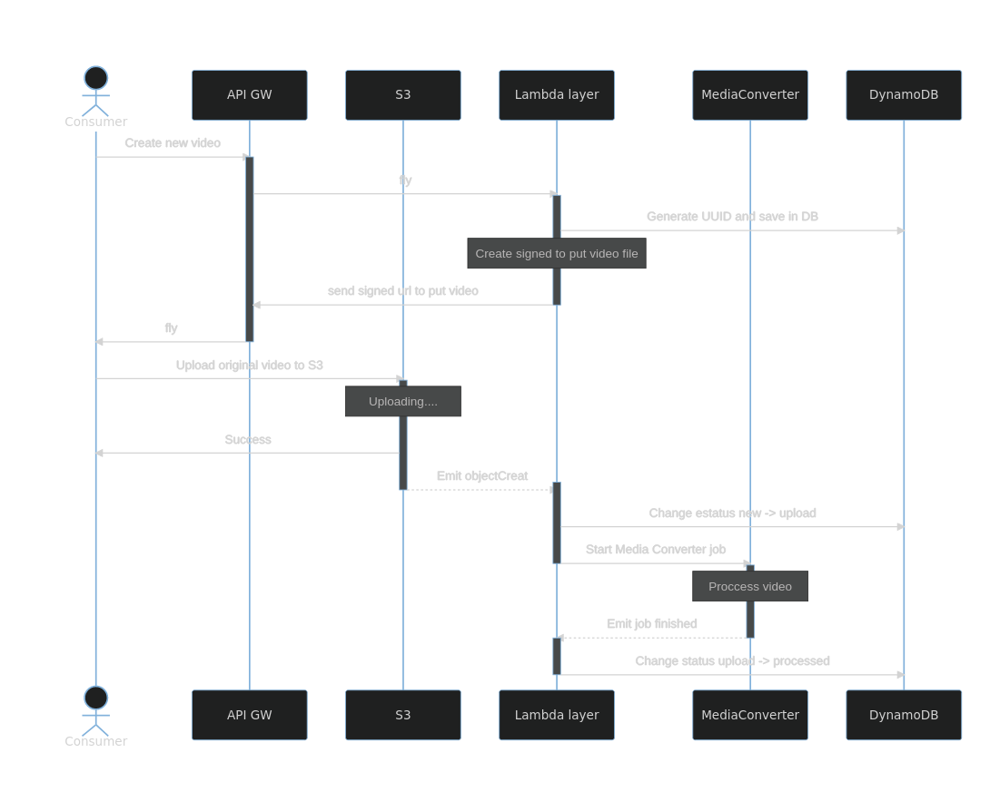

# 100% Serverless Video Transcoding solution

Serverless project to upload videos and transcode it on AWS.

**DON'T USE THIS IN PRODUCTION**

This code is only for learning reasons, or based on it for develop your
solution.

## How works ⚙️

We are going to use a few services from AWS to automatize the encoding of
upload videos, using H264 and resicing to 720px.



### Resources used

The list of resources if available in the file `infra/resources.yaml` and there
are:

* MediaConverter Queue
* DynamoDB Table
* S3 Bucket
* Lambda functions
* Api gateway

## Getting Started 🚀

### Prerequisites 📋

* Node
* AWS account

### Get sources 🔧

Clone git repo:

```
$ git clone git@github.com:exoshtw/node-admob-ssv.git
```


### Deploy 📦

You need a valid AWS account and the credentials configured in the CLI.

#### Install dependencies:

```
$ npm install
```

Or Yarn

```
$ yarn
```

You can to install the tool's dependencies:

```
$ cd tools
$ npm install
```

#### Custom your config

Open the `infra/custom.yaml` file to change names and other configurations.

#### Create Role for Video Converter

> This step is the only thing you need to do in the AWS console

You can to follow [this
guide](https://docs.aws.amazon.com/mediaconvert/latest/ug/creating-the-iam-role-in-iam.html)
from Amazon.

Name it as `MediaConvert_Default_Role` or change the name in
`infra/custom.yaml` file.

#### Deploy stack

You need to run:

```
$ npx sls deploy
```

And the magic appears.

## License 📄

@TODO
